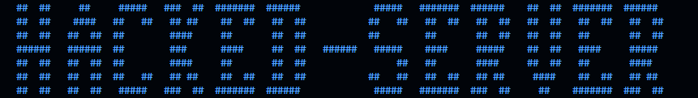
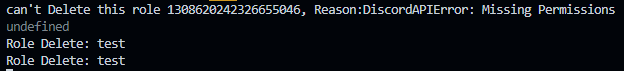

# Hacked-Server Discord Project

## Description

`Hacked-Server` is a Discord Project designed to help server administrators quickly delete specific roles and channels in case of a server compromise or cleanup.

## Features

- Delete specific roles by name
- Delete specific channels by name
- Easy configuration through `config.json`

## Prerequisites

- Server ID
- Discord Bot Token

### Error
If High Role:

## 🚨 Important Disclaimer

This project was developed as an educational tool and to assist in lawful and ethical server management.

**Warnings and Conditions:**

1. This program is to be used ONLY on servers you own or have explicit permission to manage.

2. Any use of this tool for:
   - Hacking other servers
   - Intentionally causing damage
   - Any illegal activities

   Is considered unethical and illegal.

3. The developer bears no responsibility for any misuse of the program.

4. Responsible and ethical use is the full responsibility of the user.

**Principle: `"Good tools are used for building, not destroying"`**

### Legal Notice

- Unauthorized use of this tool against servers or systems you do not own is a violation of Discord's Terms of Service and potentially criminal law.
- Users are solely responsible for ensuring they have proper authorization before taking any administrative actions.

-----

## 🚨 إخلاء المسؤولية

تم تطوير هذا المشروع كأداة تعليمية وللمساعدة في
حذف الرتب و الرومات التي سبق وتم صنعها  بواسطه مخترق السيرفر

**التحذيرات والشروط:**

1. يُستخدم هذا البرنامج فقط على الخوادم التي تملكها أو لديك إذن صريح للإدارة.

2. أي استخدام لهذه الأداة في:
   - اختراق خوادم الآخرين
   - التسبب في ضرر متعمد
   - أي نشاط غير قانوني

   يعتبر مخالفًا للأخلاق والقانون.

3. المطور غير مسؤول عن أي إساءة استخدام للاداه.

4. الاستخدام الأخلاقي مسؤولية المستخدم الكاملة.

المبدأ: **`"الأدوات الجيدة تُستخدم للبناء وليس للهدم"`**

-----
Developer : `Y.Karm (DZAN)`
